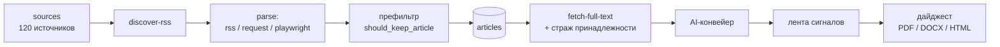
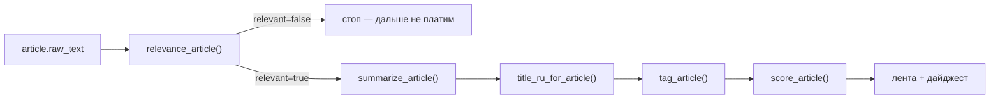

# OilTech Digest: архитектура

Документ описывает систему в том виде, в каком она реально работает на проде.
Сверено с кодом на коммите `499cd17` (2026-08-02); §3.2, §3.4 (учёт вызовов), §7–§10 и
§11 — на `7d6b8e1` (2026-09-18).

Схемы (каждая — одна страница A3, для печати и для встреч):

- [`architecture_diagram.html`](architecture_diagram.html) — единая схема
  «бизнес-логика → функции → контейнеры и серверы»;
- [`architecture_dataflow.html`](architecture_dataflow.html) — потоки данных и границы
  доверия (DFD): что пересекает периметр, чем аутентифицируется, какого класса данные.

---

## 1. Что это за система

Собирает отраслевые новости из ~120 источников, отсеивает нерелевантное, оценивает
оставшееся с помощью LLM (важность, направление, балл бизнес-эффекта) и даёт аналитику
собрать из этого месячный дайджест для заказчика в PDF / DOCX / HTML.

Ключевое архитектурное решение — **геораспределённость**. Ядро (интерфейс, база,
управление) работает в России; всё, что зависит от зарубежной сети (OpenAI, западные
источники), вынесено во внешний контур. Главный принцип:

> **РФ-ядро не делает синхронных вызовов во внешнюю сеть в пользовательском request path.**

При недоступности внешнего контура админка продолжает работать на уже собранных данных,
а внешние задачи копятся в очереди и явно показывают деградацию.

---

## 2. Контуры и размещение

### РФ-ядро — Санкт-Петербург, `109.68.213.12`, `docker-compose.yml`

| Контейнер | Роль | Порт |
|---|---|---|
| `oiltech_caddy` | reverse-proxy, авто-HTTPS Let's Encrypt, сжатие zstd/gzip | **80, 443 наружу** |
| `oiltech_app` | FastAPI + собранный React-фронт, сессии, роли | `127.0.0.1:8000` |
| `oiltech_pg` | PostgreSQL 16 — всё состояние системы | `127.0.0.1:5432` |
| `oiltech_scheduler` | цикл сбора и обработки; умолчание 6 ч, на проде 30 мин | — |
| `oiltech_worker` | фоновые задачи, очереди `default`, `ai` | — |
| `oiltech_playwright_worker` | очередь `playwright`: JS-сайты и рендер PDF | — |
| `oiltech_tasks` | трекер задач (тот же образ, `TASKS_APP_MODE=1`) | `127.0.0.1:8010` |
| `oiltech_docs` | справка на mkdocs-material | `127.0.0.1:8081` |
| `oiltech_bootstrap` | одноразовый: `init-db` + сиды, затем выходит | — |

Наружу открыт только Caddy. Всё остальное слушает loopback — БД снаружи недоступна.

### Внешний контур — Амстердам, `85.234.107.233`, `docker-compose.external-worker.yml`

Один контейнер `oiltech_external_worker`. **Stateless**: своей базы нет, соединения с
РФ-базой нет by design. Общается с ядром только по HTTPS task-API.

Очереди: `external-ai`, `external-fetch`, `external-playwright`.
Возможности: `openai`, `http_fetch`, `playwright`.

Почему не дать воркеру прямой доступ к Postgres: пришлось бы открывать БД наружу или
строить VPN; при сетевых проблемах зависают соединения; сложнее ограничить права и
аудировать, что именно внешний сервер прочитал.

---

## 3. Конвейер

### 3.1 Общий поток



### 3.2 Сбор

Три стратегии обхода, выбор — в поле `sources.parse_strategy`:

- `rss` — [`rss_parser.parse_all()`](../oiltech_digest/ingestion/rss_parser.py);
- `request` — [`request_parser.parse_source()`](../oiltech_digest/ingestion/request_parser.py):
  читает `listing_url` (без него — главную), вытаскивает ссылки, берёт первые
  `REQUEST_ARTICLE_LIMIT` (12) кандидатов — свежее первым — и вставляет те, чьего `url`
  ещё нет в базе. Новизна держится на уникальности `articles.url`; поля `last_seen_*` и
  `last_listing_hash` пишутся только для диагностики. Как выбираются ссылки и что было
  исправлено 18.09 — §11.3;
- `playwright` — [`playwright_parser.parse_source()`](../oiltech_digest/ingestion/playwright_parser.py)
  для сайтов, которые рендерят листинг скриптами.

Дальше — детерминированный префильтр
[`relevance_filter.should_keep_article()`](../oiltech_digest/ingestion/relevance_filter.py):
отсекает явный шум **без единого AI-вызова**, то есть бесплатно.

Дедупликация точных повторов: `content_hash = sha256(нормализованный title | url)`.
Кросс-источниковые перепечатки этим не ловятся — см. §8.

### 3.3 Дозагрузка полного текста

RSS часто отдаёт только анонс. Тогда статья ложится с `text_truncated = true`, и
[`article_fetcher.fetch_full_text()`](../oiltech_digest/ingestion/article_fetcher.py)
идёт по `url` за полным текстом.

**Страж принадлежности текста** (введён 28.07 после дефекта №24, коммит `1c33303`).
До него `_is_better_text` сравнивал тексты **только по длине** — поэтому листинг, пейвол
или чужой материал из JSON-LD побеждали настоящую статью, писались со статусом `ok` и
больше не перепроверялись. Порча помечалась успехом. Сейчас перед записью два рубежа
в `_ownership_rejection()`:

1. `normalize.title_matches_body()` — пересечение значимых слов заголовка с телом,
   посегментно (сплошное сравнение топило верные статьи из-за хвоста издания);
2. `normalize.compute_body_hash()` + индекс `(source_id, body_hash)` — «такое тело уже
   есть у другой статьи этого источника» означает отказ.

Отказ даёт `full_text_status = 'mismatch'` и **не затирает** прежний текст.

Фиксируется: `full_text_fetched_at`, `full_text_status`, `full_text_error`,
`extraction_method`, `body_hash`.

### 3.4 AI-конвейер

Порядок стадий в
[`pipeline.process_pipeline_articles()`](../oiltech_digest/processing/pipeline.py):

```text
релевантность → суть → перевод заголовка → тег → скоринг
```



Почему релевантность **первой**, а не после сути: гейт работает на сыром тексте — без
смещения от уже написанной сути и без лишних оплаченных вызовов по мусору. Нерелевантные
не тегируются и не скорятся.

Каждый вызов пишет строку в `ai_processing_runs` через `_record_run()` — модель, токены,
стоимость, статус. Это же таблица аудита затрат. **Исключение — судья перепечаток**
(`reprint_review`): в `ai_processing_runs` он не пишет, и его расход в учёте не виден
(найдено 17.09; замер скорости — 1,9 с на пару).

Модели задаются пер-стадийно, потому что цена ошибки разная (см.
[`config.py`](../oiltech_digest/config.py)):

| Стадия | Переменная | Почему отдельно |
|---|---|---|
| гейт релевантности | `OPENAI_RELEVANCE_MODEL` | вызов дешёвый, цена ошибки высокая → модель сильнее и reasoning `medium` |
| скоринг | `OPENAI_SCORE_MODEL` | балл прямо определяет отбор в дайджест; при `minimal` reasoning баллы систематически занижались |
| перевод | `OPENAI_TRANSLATE_MODEL` | ответ короткий, хватает дешёвой модели |

⚠️ Эти переменные задаются в `.env` **того сервера, где реально вызывается OpenAI** —
то есть внешнего воркера. Инцидент 06.2026: их прописали в ядре, гейт тихо откатился на
слабую модель, качество выборки просело.

### 3.5 Тот же конвейер во внешнем контуре

Когда `AI_EXECUTION_REGION=external`, ядро не зовёт OpenAI, а ставит задачу в очередь:

```text
ядро:   build_process_articles_payload()   → самодостаточный JSON (статьи, теги, критерии)
воркер: process_payload()                  → вызовы OpenAI
ядро:   apply_process_result()             → запись карточек, тегов, баллов, биллинга
```

Роутинг решает [`network_policy.py`](../oiltech_digest/network_policy.py) — единственное
место, где принимается решение «локально или наружу».

---

## 4. Протокол внешних задач

Machine-to-machine API, воркер всегда инициирует связь сам:

| Endpoint | Назначение |
|---|---|
| `POST /api/external-worker/claim` | забрать задачу, получить одноразовый `lease_token` |
| `POST /api/external-worker/jobs/{id}/heartbeat` | продлить lease |
| `POST /api/external-worker/jobs/{id}/progress` | сообщить прогресс |
| `POST /api/external-worker/jobs/{id}/complete` | сдать результат |
| `POST /api/external-worker/jobs/{id}/fail` | сообщить об ошибке |

Аутентификация — Bearer-токен; на сервере хранится только SHA-256, сравнение через
`hmac.compare_digest`. У каждой задачи свой `lease_token`.

Три механики, за каждой стоит оплаченный деньгами инцидент:

- **`finalizing`** — завершение застолбляется атомарно до применения результата, иначе
  истёкший lease переотдавал задачу и OpenAI биллил дважды (T2, счёт ×2);
- **`LeaseLost`** — heartbeat вернул 409, значит ядро отозвало право на работу;
  воркер обязан оборвать батч. Раньше 409 глушился и воркер жёг ~$11/час в мусор (T20);
- **lease, а не настенные часы** — признак жизни внешней задачи это продлённый lease.
  Пока это был таймаут в 60 минут, батч на 93 минуты попадал в вечную петлю: на 60-й
  минуте задача переочередивалась, воркер получал 409 и начинал заново. Круг ровно в час,
  каждый раз за деньги (T22).

---

## 5. Модель хранения

PostgreSQL 16, `psycopg` и SQL вручную, без ORM: схема простая, важна прозрачность запросов
и точечные правки под batch-обработку.

**Контент и оценки:** `sources` · `articles` · `article_cards` (суть, релевантность) ·
`tags` + `article_tags` · `scoring_criteria` + `article_scores` + `article_score_items`.

**Пользователи:** `users` (e-mail, PBKDF2-хэш, роль) · `user_sessions` ·
`user_article_states` — **личное** состояние: статус статьи (`new` / `review` / `digest` /
`archive` / `noise` / `duplicate`) и комментарий аналитика.

Модель разделения: статьи, оценки, теги и источники — **общие**; пер-юзерный только
рабочий статус и состав дайджеста.

**Дайджест:** `monthly_digests` (уникальность по `(user_id, month)`) · `monthly_digest_items`.

**Служебное:** `background_jobs` (владелец, очередь, регион исполнения, lease, попытки) ·
`ai_processing_runs` (аудит каждого AI-вызова и его стоимости) · `export_jobs`.

Удаление статей — **мягкое**: `articles.pending_deletion`. Физическое удаление
(`purge`) сносит и строки `ai_processing_runs`, то есть уничтожает историю затрат.

---

## 6. Доступ и роли

Вход по e-mail и паролю: PBKDF2-HMAC-SHA256, 200 000 итераций, соль 16 байт на пользователя
([`auth.py`](../oiltech_digest/auth.py)). Сессия — cookie `HttpOnly` + `Secure` +
`SameSite=Lax`, срок 30 дней.

Две роли, гейты `require_user()` / `require_admin()` в
[`api.py`](../oiltech_digest/api.py):

- **`user`** — своя лента, свои статусы, свой дайджест, чтение источников и справочников;
- **`admin`** — плюс управление источниками, тегами, критериями, пользователями,
  брендингом дайджеста, обслуживанием и **запуск платной AI-обработки**.

API не разделён на публичный и внутренний — это внутренний backend админки.

Аудит приватности 24.07 закрыл пять дефектов: доступ к чужому дайджест-PDF по номеру
задачи, правку общего брендинга любым пользователем, вызов обслуживания (удаляло историю
задач всем), победу чужого дайджеста над личным из-за `NULLS FIRST`, неполную очистку
состояния фронта при 401.

---

## 7. Цикл scheduler

[`scripts/docker-scheduler.sh`](../scripts/docker-scheduler.sh). Умолчание — раз в 6 часов,
**на проде `CYCLE_INTERVAL_SECONDS=1800` — каждые 30 минут**, то есть 48 циклов в сутки.
Всё, что задано «раз в N циклов», на проде срабатывает в 12 раз чаще, чем по умолчанию.

```text
maintenance-cleanup       (раз в 24 цикла)
discover-rss              (раз в DISCOVER_EVERY_CYCLES циклов)
parse                     → сбор со всех включённых источников
fetch-full-text           → дозагрузка + страж принадлежности
process | enqueue-process → AI локально ИЛИ задача во внешнюю очередь
enqueue-external-scrape   → если FETCH_EXTERNAL_ENABLED=1 (на проде включено с 17.09)
enqueue-external-refetch  → то же условие: тело обрывков у зарубежных источников
find-reprints --apply     → раз в REPRINTS_EVERY_CYCLES (24) циклов, не на нулевом
stats
```

Радар сигналов (`enqueue-daily-signal-discovery`) вынесен из MVP-1 вместе с агентным
слоем 17.09 — в цикле его больше нет.

Есть альтернативный режим `STREAMING_PIPELINE=1`: `parse-process` вместо трёх шагов —
статья проходит весь путь целиком, карточки появляются по мере готовности. На сервере
с 1.9 ГБ RAM требует `PARSE_WORKERS ≤ 5`.

---

## 8. Известные ограничения

- **Перепечатки ловятся с 17.09, но только помечаются.** Правило (разные источники,
  ≤ 5 дней, пересечение значимых слов заголовка ≥ 35%) сужает корпус до пар, ИИ-судья
  решает «одно ли это событие». Копия пишется в `article_reprints` и уходит из ленты и
  выпуска; удаления нет, пометка снимается. Кандидаты — только из видимого в ленте
  (§11.4). Задача №21.
- **Бэкап автоматический, но на том же сервере.** Крон `20 3 * * *`, первый прогон
  подтверждён 18.09 (дамп 72 МБ). Потеря сервера = потеря и базы, и копии. Задача №17.
- **Ресурс сервера на пределе:** 1.9 ГБ RAM, свободно ~116 МБ; сборка образа при живом
  стеке рискует OOM. Задача №10.
- **`pgvector` на проде отсутствует** (`postgres:16`, доступен только `pg_trgm`) — влияет
  на выбор реализации №21.
- **Проверка типов фронта выключена в сборке образа** (`Dockerfile` вызывает `vite build`
  без `tsc -b`) ради экономии памяти. Тех-долг T12.
- **Трекер задач пишет в `BACKLOG.md`** — файл под git. Деплой через `git reset --hard`
  сотрёт задачи, созданные через UI. Тех-долг T11.
- **Батч всё-или-ничего:** результат внешней задачи сохраняется только в `complete`,
  промежуточных чекпойнтов нет. Тех-долг T23.

---

## 9. Конфигурация

Полный список — [`.env.example`](../.env.example). Существенное:

| Переменная | Смысл |
|---|---|
| `DATABASE_URL` | подключение к Postgres |
| `EXTERNAL_WORKERS_ENABLED` | главный рубильник внешнего контура |
| `AI_EXECUTION_REGION` | `ru` — считаем сами, `external` — отдаём воркеру |
| `FETCH_EXTERNAL_ENABLED` | разрешить внешний сбор источников с `network_region='external'` |
| `EXTERNAL_WORKER_TOKEN_HASH` | SHA-256 токена воркера (на стороне ядра) |
| `CORE_API_URL`, `EXTERNAL_WORKER_TOKEN` | на стороне воркера |
| `OPENAI_API_KEY`, `OPENAI_MODEL` | базовые параметры LLM |
| `OPENAI_RELEVANCE_MODEL` / `_SCORE_MODEL` / `_TRANSLATE_MODEL` | пер-стадийные модели |
| `CYCLE_INTERVAL_SECONDS` | период цикла scheduler (прод — 1800) |
| `REQUEST_ARTICLE_LIMIT` | сколько кандидатов брать с листинга (6) — см. §11.3 |
| `REPRINTS_EVERY_CYCLES` / `_DAYS` / `_LIMIT` | шаг перепечаток: период в циклах, окно, потолок пар |
| `AUTH_COOKIE_SECURE` | `0` только для локальной разработки по http |

Секреты в git не попадают. Отдельного хранилища секретов нет.

---

## 10. Развёртывание

**Схема не менялась** (проверить: `git diff <было>..HEAD -- oiltech_digest/db/schema.sql`) —
`bootstrap` не трогаем вообще. Так выкатывались 17–18.09 без простоя:

```bash
git fetch origin && git reset --hard origin/main
docker compose build app tasks worker scheduler
docker compose up -d --no-deps app tasks worker scheduler
```

**Схема менялась:**

```bash
git fetch origin && git reset --hard origin/main
docker compose stop tasks worker scheduler
docker compose build app tasks worker scheduler bootstrap
docker compose run --rm bootstrap
docker compose up -d --no-deps app tasks worker scheduler
```

Почему так, а не `down && build && up -d`:

- **`bootstrap` берёт `AccessExclusiveLock` на `background_jobs`, а `oiltech_tasks` в неё
  непрерывно пишет** — дедлок, сайт лежал ~10 минут 17.09. Отсюда `stop tasks` перед ним.
- **`up -d` тянет `bootstrap` как зависимость** и роняет запуск сервисов — отсюда `--no-deps`.
- **`build app scheduler worker` не пересобирает `bootstrap`**, а схему применяет именно он:
  таблица молча не создаётся, бутстрап отчитывается об успехе. Проверка — `grep` нового
  объекта в `/app/oiltech_digest/db/schema.sql` внутри образа бутстрапа.
- `down` перед сборкой нужен, только если сборка идёт не из кэша и памяти не хватает
  (1,9 ГБ); сборки 17–18.09 из кэша прошли при живом стеке.

⚠️ Именно `reset --hard`, а не `pull` — прод расходился с локальным main.
⚠️ Не деплоить при активных AI-задачах: рестарт рвёт lease внешнего воркера.
⚠️ С Mac владельца SSH до РФ-ядра проходит только с `-o BindInterface=en0`: маршрут
через VPN режет пакеты с данными. NL-воркер (`85.234.107.233`) по SSH не отвечает ни с
Mac, ни с РФ-ядра — ни ICMP, ни порт 22; задачи из очереди при этом берёт исправно.

---

## 11. Правила: источники, парсеры, воркеры

Выведены из обхода 30 молчащих источников 18.09 и инцидентов 17.09. За каждым правилом —
случай, где его нарушение стоило времени или данных. Подробности — хендоффы
`2026-09-17_strip-agents-tags-deploy.md` и `2026-09-18_obhod-istochnikov.md`.

### 11.1 Как проверять источник

- **Смотреть глазами парсера, а не своими.** Hart Energy с домашнего адреса отдаёт 441 КБ,
  с РФ-прода — 403. Точка обзора парсера — РФ-ядро (для `network_region='auto'`) или
  NL-воркер (для `external`). Инструмент без записи в базу — на РФ-ядре:

  ```bash
  docker compose exec -T playwright-worker python -m oiltech_digest.cli \
    source-dump-listing <id> --render --url <адрес> --limit 200
  ```

- **Ручной ввод ссылки перебирает стратегии** (`probe_strategies`): RSS (и не мёртвая ли
  лента), запрос, браузер; закрыт с РФ — маршрут через воркер; не нашлось статей —
  источник заводится выключенным. Держатель вручную импортированной статьи не опрашивается.
- **Через NL-воркер разведку не вести.** Режима «только посмотреть» у него нет:
  `scrape_source` берёт настройку источника из базы в момент выдачи, а ядро сразу
  вставляет всё, что воркер вернул. Временную ссылку через него не проверить, не записав.
- **Сайт отвечает разным точкам по-разному** — см. таблицу в §11.5.
- **«200 и ссылки есть» ничего не доказывает.** Смотреть дату самой свежей публикации на
  самом сайте. Молчание 30 дней ≠ поломка: Spears пишет раз в 1–2 месяца, ЦДУ ТЭК
  перестал публиковать в январе 2025, KazPetroDrilling — в 2022.
- **`000` у curl — чаще не сайт, а клиент:** сертификат российского УЦ (macOS ему не
  доверяет; у проекта `ingestion/extra_ca.pem`), устаревшее TLS-согласование
  (Белоруснефть: curl падает, Python-фоллбэк и Chromium проходят), cookie-редирект сам
  на себя (Сургутнефтегаз: без банки cookie — бесконечные 302).
- **Дубли источников искать по всем строкам**, не по первой найденной: S&P Global (17 и 85
  на одном адресе), Neftegaz.ru (36 активен, 53 в архиве), CNPC (исключение попало не в ту строку).
- **Капчу и интерактивные проверки («подтвердите, что вы человек») не проходим** — ни
  агентом, ни кодом. Для таких сайтов законные каналы: Google News RSS по сайту
  (заголовок, ссылка, дата — без текста, заголовки бывают пустыми), рассылка издания,
  запрос издателю. Случай — Energy Voice.

### 11.2 Как настраивать источник

- **`listing_url` — раздел новостей, а не главная.** С главной парсер тащит навигацию, и
  она ложится в ленту «статьями»: у Сургутнефтегаза это «История дивидендных выплат»,
  «Закупки», «Банковские реквизиты»; у Новатэка — 82 «статьи» из 86.
- **Хост ленты = хост статей.** Ссылки на другой хост отбрасываются: у ТПУ новости на
  `news.tpu.ru`, источник был заведён на `tpu.ru` — не прошла ни одна.
- **RSS проверять на дату последнего пункта:** ленты умирают молча (PETRONAS — с 05.2025,
  при живом сайте с релизами каждые 2–3 дня).
- **Переименование бренда ломает адрес без ошибки:** старый адрес S&P Global Commodity
  Insights отдаёт 200 — лендинг S&P Global Energy, где статей нет.
- **Менять нормализацию URL — только с миграцией хранимых адресов.** Смена правила
  финальной косой черты (~20.07) сделала все старые адреса «новыми»: 22.07 в базу разом
  легли повторно те же страницы у десятка источников, и это выглядело как их «улов».

### 11.3 Парсер: что исправлено 18.09 и какие правила из этого следуют

Исправлено в коде (`2bac79c`…`7d6b8e1`), выкачено на РФ-ядро. **NL-воркер работает
на старом коде до пересборки** — см. хендофф `2026-09-18_obhod-istochnikov.md`.

1. **Порядок кандидатов.** Было: из датированных под лимит шли самые старые, из
   недатированных — первые по алфавиту адреса. Стало: свежее первым; при селекторе —
   порядок ленты. Лимит 6 → 12 (`config.py` и `docker-compose.yml` — задан в двух местах).
2. **Ссылка без текста** (карточка-картинка, «Подробнее», «Learn more», «View Press
   Release») берёт заголовок из карточки: заголовок h1–h4 → атрибуты → alt →
   первый содержательный фрагмент карточки.
3. **Селектор человека главнее эвристик мусора.** У Белоруснефти новости лежат в
   `/detail-pages/event/…`, и фильтр по слову `event` резал ленту даже при верном
   селекторе. Ссылки, выбранные `article_link_selector`, общий фильтр не режет.
4. **Поддомены сайта — свои** (`news.tpu.ru` для `tpu.ru`); похожие домены — нет.
5. **Даты:** «17.09.2026», «17 сентября 2026», «24/08/2026», «Sep 18, 2026», дата в
   адресе (`/2026/09/17/`, `-2026.09.17-`, `news-14092026`, `t20260914`); в статье —
   JSON-LD и `itemprop`. Модуль `ingestion/dates.py`, только явные формы.
6. **Кодировка — декодировать самим**, `normalize.parse_html`. libxml2 2.13 не учитывает
   `<meta charset>`, если кириллица стоит раньше него (Nuxt: `<title>` первым). Было
   58 статей с «Ð¡Ñ…» в заголовке и тексте. **Правило: байты в lxml не отдавать.**
7. **Запасной текст статьи — без `<script>`/`<style>`.** Было 42 статьи длиннее 50 тыс.
   знаков (36 — со скриптами, максимум 768 тыс.): модель судила JavaScript.
8. **Относительные ссылки — от конечного адреса.** Лента после переадресации (CNOOC:
   `/zxzx/gsxw/` → `/zxzx/gsxw/gsxw/`) давала ссылки без звена пути, все 404. Браузер
   парсера вписывает `<base href>` с конечным адресом, разбор листинга его учитывает.
   Для `request`-источника с HTTP-редиректом — ставить в `listing_url` конечный адрес.
9. **Пара попыток браузера** (`LISTING_SETTLE_MS` 5→12 с, `ARTICLE_SETTLE_MS` 3,5→9 с) —
   одна функция для ядра, воркера и диагностики. Блок (403/429/503) не повторяется.

**Правило проверки правок парсера:** тест на синтетике проходит — это ещё не
доказательство. Две правки 18.09 прошли тесты и не сработали на проде (кодировка,
«Learn more»); поймала их только проверка новым кодом на живых лентах. Проверять
на проде до записи настроек в базу.

### 11.4 Правила для воркеров

- **Stateless-воркер получает данные параметром, а не читает базу.** Базы у NL-воркера
  нет; чтение падало в `except`, и блок тематик в гейте уезжал пустым — именно на проде.
  Локальные тесты такого не ловят никогда: там база есть.
- **Любой вызов модели — только через внешний контур.** С РФ-адреса OpenAI отвечает 403
  по географии: судья перепечаток, вызванный напрямую, дал 12 ошибок из 12.
- **Каждый долгий обработчик шлёт heartbeat.** Lease — 600 с. `scrape_source` и
  `refetch_text` писались позже инцидента 24.07 и шли без него: задача 3908 умерла
  на третьей попытке вместе со всем пакетом.
- **Молчаливый хост получает паузу, как громкий.** Раньше пауза ставилась только на
  403/429, а таймаут стоил 63 с на **каждую** статью того же хоста. Пауза за таймаут
  короче (300 с против 900): таймаут бывает разовым, бан — нет.
- **Heartbeat — всем стратегиям сбора, не только RSS.** До 18.09 `request` и `playwright`
  на воркере шли без него при lease 600 с.
- **Воркер не качает известное.** Базы у него нет, и он качал каждую статью листинга
  на каждом цикле. Ядро кладёт в задачу `known_urls` — последние адреса этого сайта.
- **Внешний воркер однопоточный.** «`queued`, `claimed_by` пуст» не значит «воркер
  мёртв» — смотреть `status='running'` у соседней задачи.
- **Очередь `external-playwright` воркер обслуживает** — задача 3750 забрана за 5 с.
  Вывод от 17.09 «не обслуживает» был ошибочным.
- **Кандидаты для ИИ-судьи — только из видимого в ленте** (архивный источник, пометка на
  удаление, отказ гейта — вон). Без этого 39 из 71 пары состояли из невидимых статей,
  а в 6 главной становилась невидимая копия и новость пропадала из ленты целиком.
- **Полезный шаг планировщика — с включённым умолчанием.** `FETCH_EXTERNAL_ENABLED=0`
  держал выключенным весь зарубежный контур; включение дало +105 статей за прогон.

### 11.5 Кто откуда видит сайт

Замер 18.09 с пяти точек: домашний адрес РФ, хостинг KZ, дата-центр NL (LeaseWeb),
РФ-прод, настоящий браузер.

| Барьер | Примеры | Куда вести |
|---|---|---|
| Режет российские адреса | QatarEnergy | NL-воркер |
| Пускает NL-дата-центр обычным запросом | Wood Mackenzie | NL-воркер, браузер не нужен |
| curl — 403 везде, настоящий браузер проходит | TechnipFMC, OPEC, S&P Global, Weatherford | браузер; проходит ли его headless-Chromium воркера — не проверено |
| Режет **любой** дата-центр (и РФ, и NL) | Hart Energy, Saudi Aramco | ни один наш воркер; только законные альтернативы |
| Интерактивная капча | Energy Voice | не автоматизируется, см. §11.1 |
| Антибот для curl, браузер проходит без действий | PetroChina (412), CNOOC (JS-заглушка) | браузер |
